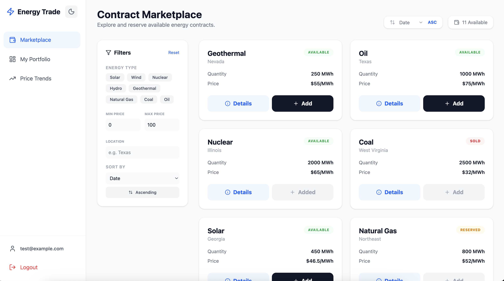

# Energy Contract Dashboard

A comprehensive dashboard for managing and analyzing energy contracts, featuring a FastAPI backend and a React frontend.



## 🛠 Setup Instructions

### Prerequisites

- **Node.js** (v18+ recommended)
- **Python** (v3.11+ recommended)
- **Supabase Account** (for database and authentication)

### Server Installation & Setup

1. Navigate to the server directory:
   ```bash
   cd server
   ```
2. Install dependencies:
   ```bash
   pip3 install -r requirements.txt # or pip install
   ```
3. Create a `.env` file based on the provided values (see Environment Variables section).
4. Run the server:
   ```bash
   python3 main.py # or python main.py
   ```

### Client Installation & Setup

1. Navigate to the client directory:
   ```bash
   cd client
   ```
2. Install dependencies:
   ```bash
   npm install
   ```
3. Start the development server:
   ```bash
   npm run dev
   ```

## 🔑 Environment Variables

The server requires the following variables in `server/.env`:

```env
SUPABASE_URL=your_supabase_project_url
SUPABASE_KEY=your_supabase_anon_key
```

## 🗄 Database Setup

1. **Create Tables**: Run the following SQL in your Supabase SQL Editor:

```sql
-- Create Contracts Table
CREATE TABLE IF NOT EXISTS contracts (
    id UUID PRIMARY KEY DEFAULT gen_random_uuid(),
    energy_type TEXT NOT NULL,
    quantity_mwh NUMERIC NOT NULL,
    price_per_mwh NUMERIC NOT NULL,
    delivery_start DATE NOT NULL,
    delivery_end DATE NOT NULL,
    location TEXT NOT NULL,
    status TEXT DEFAULT 'Available',
    provider TEXT,
    description TEXT,
    carbon_intensity NUMERIC,
    created_at TIMESTAMPTZ DEFAULT NOW()
);

-- Create Portfolio Table
CREATE TABLE IF NOT EXISTS portfolio (
    id UUID PRIMARY KEY DEFAULT gen_random_uuid(),
    user_id UUID NOT NULL,
    contract_id UUID NOT NULL REFERENCES contracts(id) ON DELETE CASCADE,
    created_at TIMESTAMPTZ DEFAULT NOW(),
    UNIQUE(user_id, contract_id)
);
```

2. **Seed Data**: Run the seeding script to populate initial data:
   ```bash
   cd server
   python seed.py
   ```

## 🚀 API Documentation

Once the server is running, you can access the interactive API documentation at:

- **Swagger UI**: [http://localhost:8000/docs](http://localhost:8000/docs)

## 🧠 Assumptions and Design Decisions

- **Frontend**: Built with **React** and **Vite** for fast development. **Tailwind CSS** is used for styling, and **Lucide React** for iconography.
- **State Management**: **Zustand** was chosen for its simplicity and low boilerplate compared to Redux.
- **Backend**: **FastAPI** provides a high-performance, asynchronous API layer with automatic OpenAPI generation.
- **Database/Auth**: **Supabase** is used as a backend-as-a-service to handle PostgreSQL storage and User Authentication seamlessly.
- **Visualizations**: **Recharts** is used to provide interactive price trends and portfolio breakdowns.

## ⚠️ Known Limitations & Future Improvements

- **Unit Tests**: Currently, the application lacks comprehensive automated testing. Adding Pytest for the backend and Vitest/React Testing Library for the frontend would be beneficial
- **Pagination**: The marketplace and portfolio views currently load all records at once. Server-side pagination should be implemented for better scalability with large datasets.
- **Error Handling**: While basic error handling is in place, more granular user feedback for network failures or edge cases could be added
